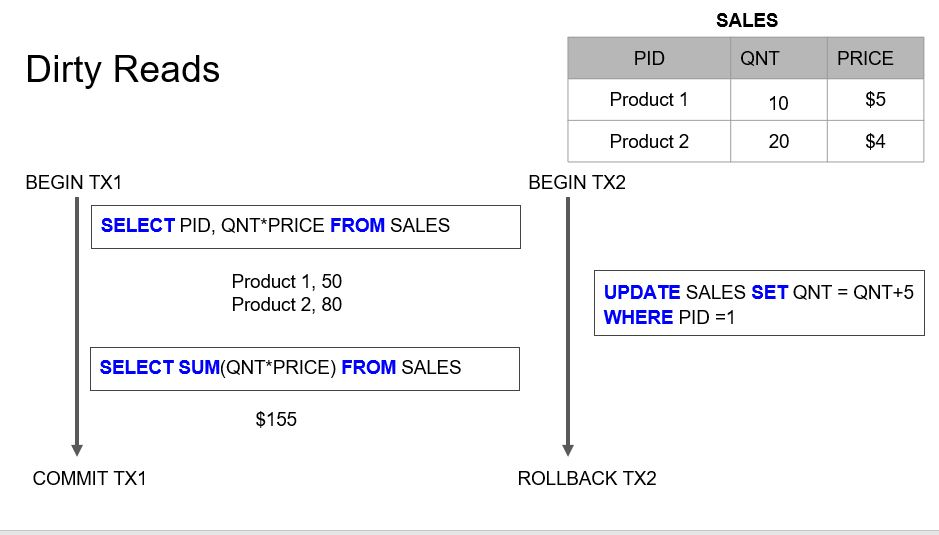
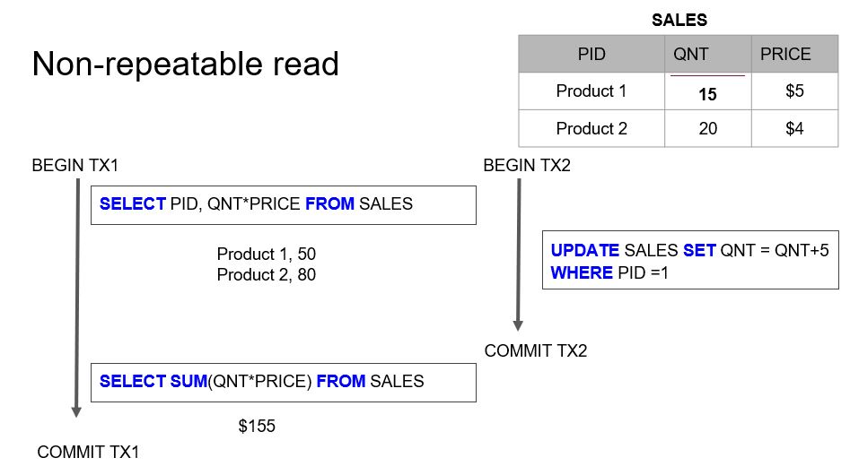
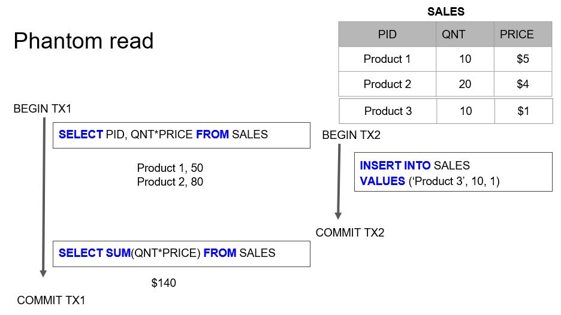

= Notes on DB engineering 
:toc: 

== ACID

=== Transaction

- Collection of queries
- A Unit of Work
- Account  Deposit (SELECT, UPDATE, UPDATE)
    1. `SELECT balance FROM Account WHERE ID=1`
    2. Check if Balance deposited is available
    3. `UPDATE Account SET balance = balance - 100 WHERE ID=1`
    4. `UPDATE Account SET balance = balance + 100 WHERE ID=2`
    5. COMMIT

=== Atomicity

> All queries must succeed. If fail, then rollback everything. `

=== Isolation

> Every transaction is isolated. (Can my inflight transactions see changes made by other transaction)

==== READ phenomena

> READ ugliness due to lack of ISOLAION.

|===
|Type | Description | Example | Links

| DIRTY READS | Some other transaction made a change which was not committed; hence my transaction saw uncommitted change. |  | 

| NON-REPEATABLE READS | Read COMMITTED data from an `UPDATE` query from another transaction |  | 

| PHANTOM READS | Read COMMITTED data from an `INSERT` or `DELETE` query from another transaction |  | 

|  MISCELLANEOUS - (Lost updates)  | When the value you updated is changed (but not committed) by some other transsaction. Hence, your update is lost. | | 

|===

1. 

 

2. 

3. 

4.

Ayman: Do example for all 4

==== ISOLATION levels

=== Consistency

=== Durability     

> Committed transactionsmust be persisted permanentlyin a non-volatile storage

== Indexing, Partitioning, Sharding

=== Index Scan vs Index-only Scan

=== Horizantal vs Vertical Partitioning

=== SQL Pagination with Offset is evil

== Concurrency Control

== DB replication

=== DB System Design

=== Build URL shortener DB Design

== DB Engines

=== B-Tree DB Engines

==== MyISAM

==== Aria

==== InnoDB

==== XtraDB

==== SQLite

==== BerkleyDB

=== LSM Tree DB Engines

==== LevelDB

==== RocksDB

== DB Security

== Miscellaneous DB Discussion

=== Distributed Transaction

=== Server-side vs Client-Side DB

